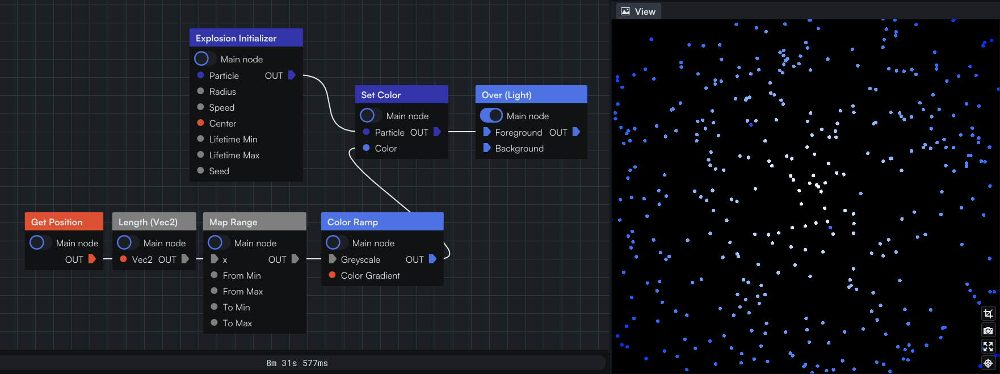

import DownloadProjectButton from "@site/src/components/DownloadProjectButton"

A "Get Attribute" node (Color, Age, Position, etc.) needs to come in the graph somewhere before a particle node (dark blue). It will implicitly get the attribute of the current particle of the current particle system. You will typically use it to set another attribute (e.g. change Color based on Age), or decide to kill a particle before it reaches its lifetime (e.g. if if goes outside of the screen) (using the "Kill particle" node), or more exotic would be a force that changes based on an attribute of the particle (e.g. only apply gravity for particles that are old enough).

Here is an example:

<DownloadProjectButton link="/demo-projects/particle_get_attribute.coollab"/>